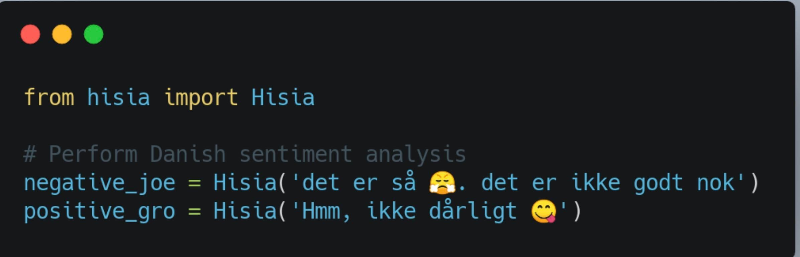

Hisia
==============================

:blush: :smiley: :relaxed: :yum: :wink: :smirk: :flushed: :worried: :frowning: :triumph: :disappointed: :angry: :persevere: :confounded: :shit: 


A Danish sentiment analyzer using scikit-learn LogisticRegression



```python
from hisia import Hisia

negative_joe = Hisia('Det er simpelthen ikke okay :(')
negative_joe.sentiment
# from hisia import Hisia

negative_joe = Hisia('Det er simpelthen ikke okay :(')
negative_joe.sentiment
# Sentiment(sentiment='negative', positive_probability=0.008, negative_probability=0.992)
negative_joe.explain
# {'decision': -4.8335798389992055,
#  'intercept': 0.809727254639209,
#  'features': {(':(', -4.36432604514099),
#               ('ikke', -3.273671001915033),
#               ('simpelthen', -2.450742871314483),
#               ('simpelthen ikke', -1.9214388345665114)}
# }

positive_gro = Hisia('Det var ikke dårligt')
positive_gro
# Sentiment(sentiment=positive, positive_probability=0.684, negative_probability=0.316)
positive_gro.explain
# {'decision': 0.7739625583753332,
#  'intercept': 0.809727254639209,
#  'features': {('dårlig', -8.910130726393785),
#              ('ikke', -3.273671001915033),
#              ('ikke dårlig', 5.126914312204595)}
# }

```
### Hisia (Emotions)
_Hisia_ is a Swahili word for emotion/feeling. My initial thought was to call it _Følelser_, a Danish word for feeling but it was just not right. As a Tanzanian, I went with Swahili as it was much more of a package name I would like to install from PyPI. :) 

```bash
pip install -U hisia
```

### Data and Models Used in Hisia

**Data:** 2016 TrustPilot's 254,464 Danish reviews' body and stars and [8 fake reviews]*20 see notes for the explanation.<br>
&ensp; _Update_: 2021-10-02: Political Data from [Sentiment Analysis on Comments from Danish Political Articles on Social Media](https://github.com/steffan267/Sentiment-Analysis-on-Danish-Social-Media)

**Models**<br>
Hisia, _LogisticRegression_ with SAGA, a variant of Stochastic Average Gradient (SAG), as a solver, L2 penalty was select for the base model. Test score **accuracy is ca. 93%** and **recall of 93%**. SAGA was selected because it is a faster solver for large datasets (rows and columns wise). As a stochastic gradient, the the memory of the previous epoch gradient is incorporated/feed-forward to the current epoch. This allows a faster convergence rate. Seeds: 42 in data split of 80% training, 20% test, and 42 in the model used for reproducibility. Check notebooks for other parameters.

HisiaTrain, _SGDClassifier_, Stochastic Gradient Descent learner with smooth loss 'modified_huber as loss function and L2 penalty. Test score **accuracy 94%** and **recall of 94%**. SGDClassifier was select because of partial_fit. It allows batch/online training.

**Note:** This score reflects models in regards to TrustPilot reviews style of writing.<br>
 > 8x20 fake reviews. TrustPilot reviews are directed towards products and services. A word like 'elsker'(love) or 'hader'(hate) were rare. To make sure the model learns such a relationship, I added 8 reviews and duplicated them 20 times. These new sentences did not increase or decrease the model accuracy but correctly added the coefficient of the words love, hate and not bad (ikke dårligt). 

Notebook folder contains playground [model_train notebook](https://github.com/Proteusiq/hisia/blob/master/notebooks/model_training.ipynb) to reproduce the model scores and also explore what the model has learned. Same parameters and data used to train Hisia.


# News & Updates

Hisia is part of [sprogteknologi.dk](https://sprogteknologi.dk/dataset/hisia) tools
Comparing [Afinn (Lexicon) and Hisia (Logistic Regression)](https://github.com/Proteusiq/hisia/blob/master/notebooks/afinn_hisia_comparison.ipynb) scoring models


Features
--------
- Sentiment analysis
- Sentiment explainer
- Sentiment reinforcement learning (Coming Soon)
- Sentiment retrainer (Coming Soon)


Project Organization
------------

    ├── LICENSE
    ├── README.md         
    │
    ├── notebooks          <-  Jupyter notebook. Reproduce the results, show model explanations, and comparing with afinn
    │   └── model_training.ipynb
    │   └── afinn_hisia_comparison.ipynb
    │   └── helpers.py          
    │                         
    │
    ├── hisia              <-   Source code for use in this project.
    │   ├── __init__.py    <-   Makes hisia a Python module
    │   ├── hisia.py       <-   hisia a sentiment predictor and explainer
    │   │
    │   ├── data           <-  Path to training and validating dataset and stopwords: data folder is inside hisia for retrain
    │   │   └── data.json
    │   │   └── data_custom.json
    │   │   └── stops.pkl
    │   │
    │   ├── models         <-  Helpers, frozen model, models trainer
    │   │   │                 
    │   │   ├── base_model.pkl
    │   │   ├── helpers.py
    │   │   └── train_model.py
    │   │
    │   └── visualization  <-  Results oriented visualizations
    │       └── ROC.png
    │       └── ROC_test.png
    │
    ├── tests              <-   Path to tests to check models accurance, datatypes, scikit-learn version
    │   ├── __init__.py
    │   ├── conftest.py
    │   ├── test_basemodel_results.py
    │   ├── test_data.py
    │   ├── test_scikit_version.py
    │   ├── test_tokenizer.py  
    │
    │
    └── tox.ini            <- tox file to trains base models and run pytests


--------
# Bugs and Errors: 6% Expected Error
_"All models are wrong, but some are useful"_ There is no magic. Expect the model to make very basic mistakes. To help in training a better model, post an issue with the sentence and expected results, and model results. Because of data limitation, this model performs very well in relationship to products or companies reviews, but limited outside those domain.


# TODO
- [X] Benchmark AFINN and Hisia on Non-Trustpilot data: [comparison results](https://github.com/Proteusiq/hisia/blob/master/notebooks/afinn_hisia_comparison.ipynb)
- [ ] Use Danish BERT for feature extraction inside of Scikit-Learn Transformers
- [X] Fix path to the model issue
- [ ] Remove more useless words (stop_words)
- [ ] Finish HisiaTrainer

# Retrain and Test: For Developers
Coming Soon
